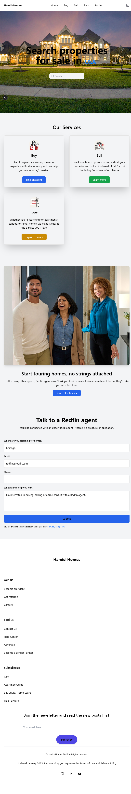

# Next.js Real Estate Project

A modern real estate platform built with Next.js, featuring property listings, user authentication, and advanced search capabilities.

## Project Screenshot



## Features

- 🏠 Property Search & Listings
- 👥 User Authentication
- 💼 Agent/Realtor Profiles
- 📱 Responsive Design
- 🔍 Advanced Search Filters
- 📝 Property Management

## Tech Stack

- Next.js
- TypeScript
- Tailwind CSS
- NextUI
- Drizzle ORM
- PostgreSQL
- NextAuth.js

## Getting Started

1. Clone the repository:
```bash
git clone https://github.com/yourusername/nextjs-real-estate-project.git
```

2. Install dependencies:
```bash
npm install
# or
yarn install
```

3. Set up environment variables:
```bash
cp .env.example .env.local
```

4. Run the development server:
```bash
npm run dev
# or
yarn dev
```

Open [http://localhost:3000](http://localhost:3000) with your browser to see the result.

## Contributing

Contributions are welcome! Please feel free to submit a Pull Request.

## License

This project is licensed under the MIT License - see the LICENSE file for details.

# test user details
username: usertest
Email: usertest@gmail.com
Password: Password34343@

jj


# test user details
username: usertest232
Email: usertest2323@gmail.com
Password: Password342323343@
g

@facebook authenticaion
@twetter verification 
@google
@discord
docume


final year project 

fina


final test user common
asiyakahn232@gmail.com
asiya32323@H


adding 

second admin test
admin232test22@gmail.com
admin232lahre34@@
